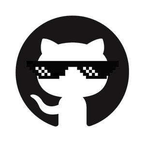
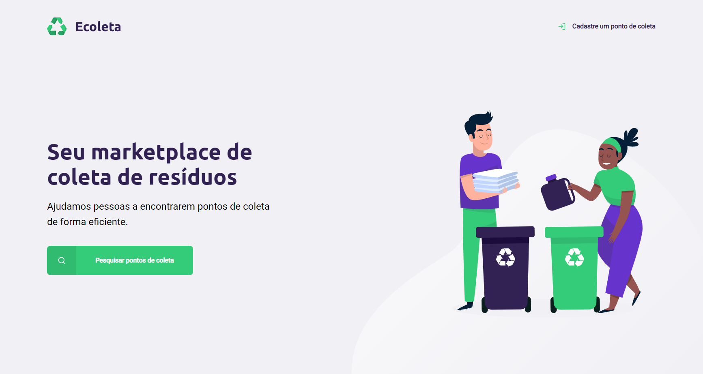

<div align="center">

</div>

# Ecoleta
 Projeto desenvolvido na #NextLevelWeek da Rocketseat.

 Marketplace para cadastro e pesquisa de pontos de coleta de resíduos.



## Tecnologias

 HTML <br>
 CSS <br>
 JavaScript <br>
 NodeJs <br>
 SQLite <br>

## Instalação

Configurar Projeto Nodejs
```sh
npm init -y
```

Instalar Express (Servidor)
```sh
npm install express
```

Instalar NodeMon
```sh
npm install nodemon
```

Instalar Nunjucks
```sh
npm install nunjucks
```

## Meta

Filipe Freitas <br>
 [@filipe.freitas](https://instagram.com/filipe.freitas) <br>
 [@F7_freitas](https://twitter.com/f7_freitas) <br>
 filipe.ifto@gmail.com